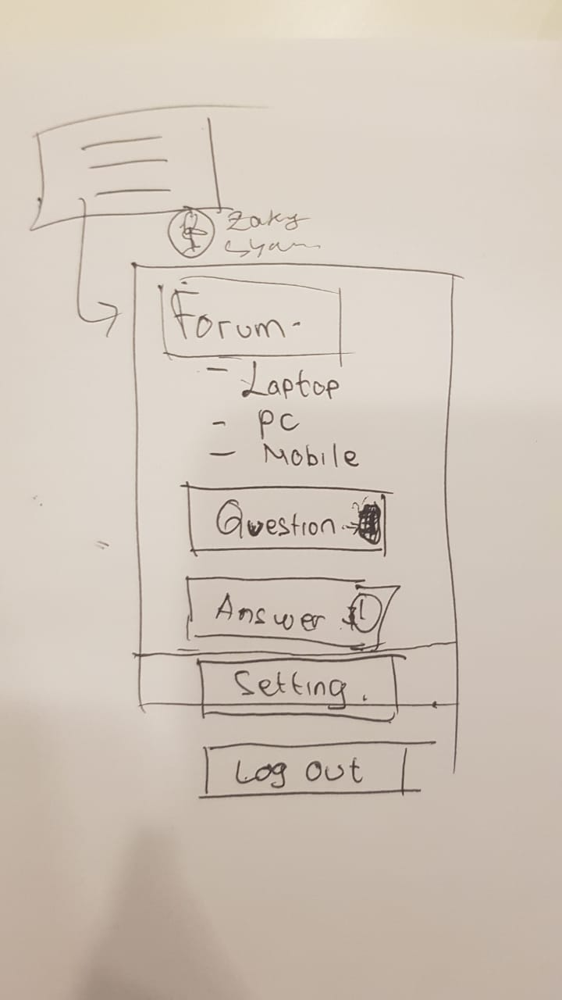
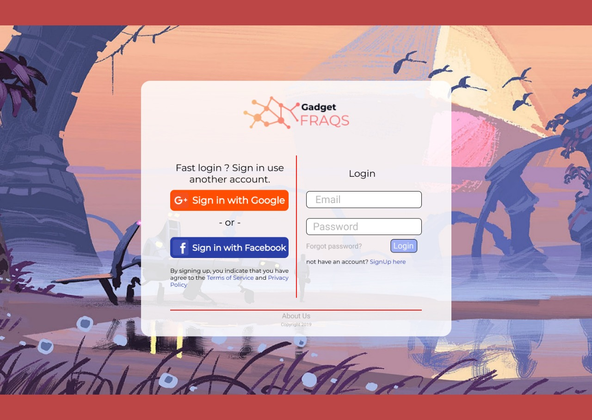
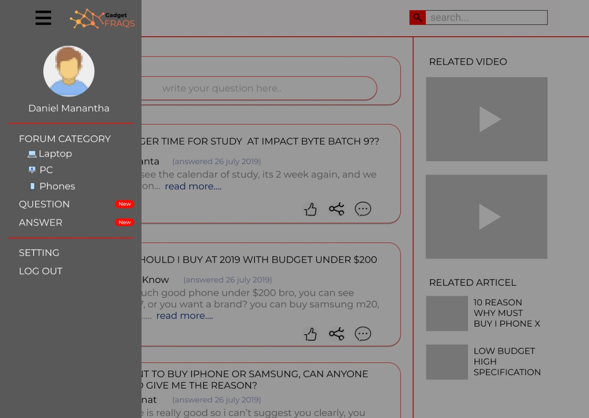
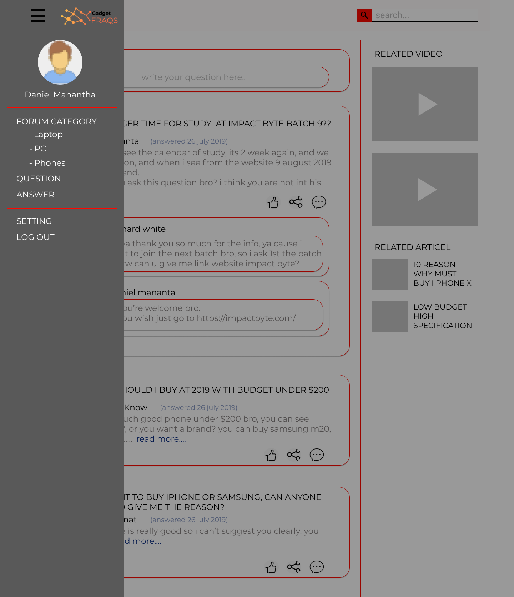
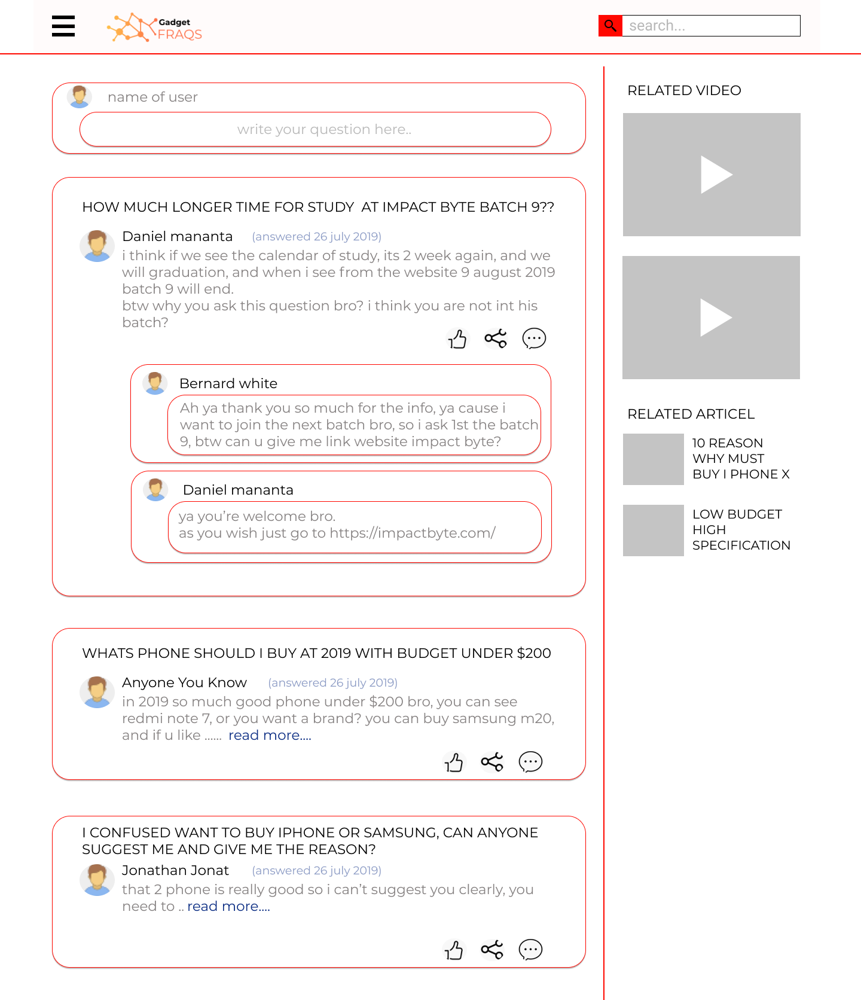
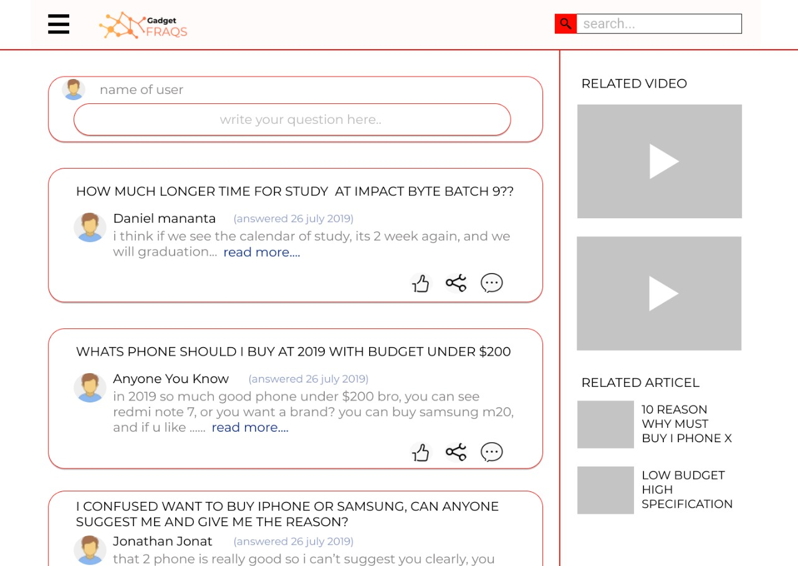
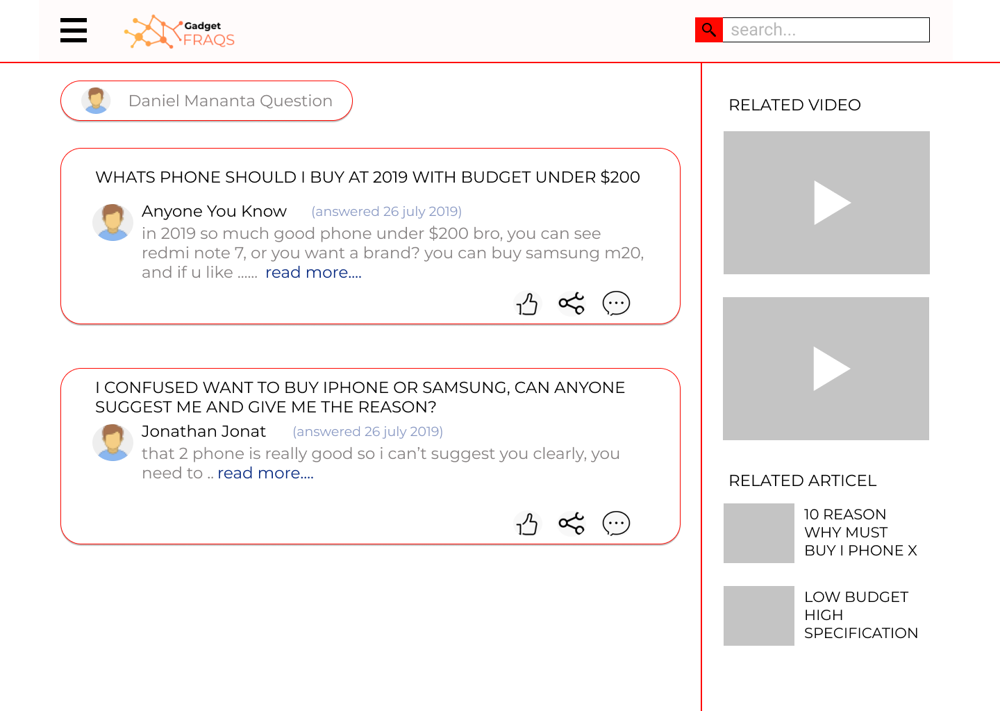
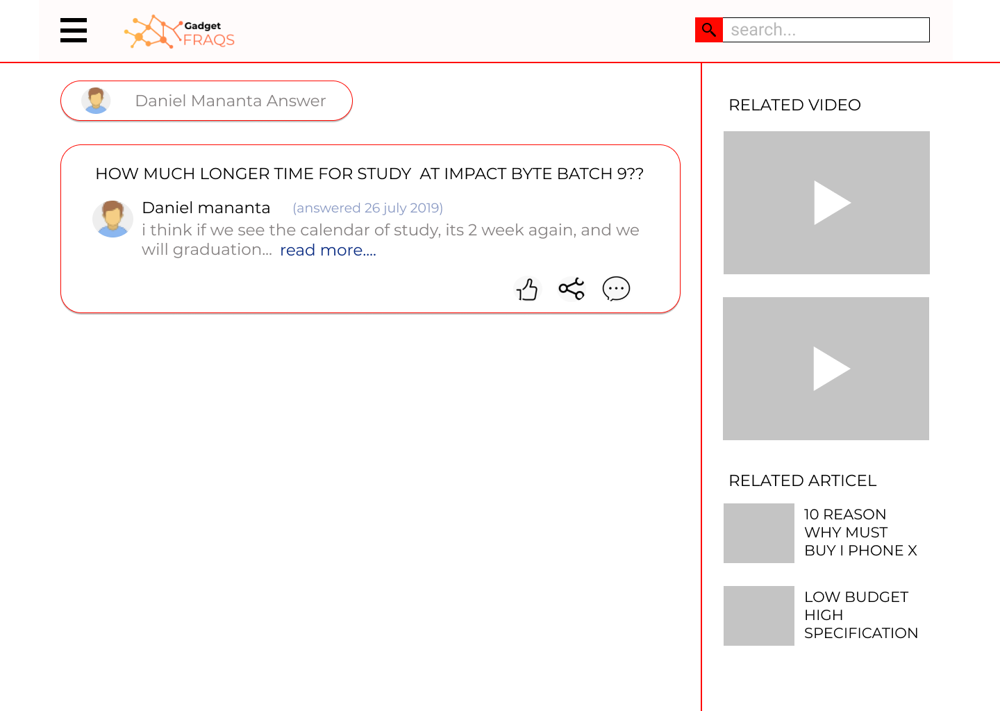

# Gadget-Fraqs Frontend with React & Redux

<!-- [](https://app.netlify.com/sites/ideabyte/deploys) -->

Check other documentations here:

- [React Documentation](README_REACT.md)

## Tech Stack

- React: To component-based web application
  - React Helmet: To change the title when we change the page in Router
  - React Hot loader: To reload the changes in development without full page reload
  - React Router: To manage multiple pages/routes of the application
- Redux: To managing global state in store
  - Redux Devtools extension: To inspect all Redux behavior
  - Redux Logger: To log our actions in the console
  - Redux Thunk: To asynchronous operations in reducer
- CSS in JS: To style the components without CSS file
  - Emotion: To style the components flexibly with `styled` or other ways
- Axios: To request/fetch data to/from the backend API server
- Draft.js: To make the `textarea` with WYSIWYG editor
- Filestack: To upload and retrieve images
- JWT Decoder: To decode JWT that is saved in the browserStorage

## Setup

Before start the code we need to setup npm. 
```
$ npm install
```
<hr>
Then install the packages.<br>
These are our packages.

```txt
$ npm install react redux redux-thunk react-redux axios react-router-dom
```
Then you install another styling like emotion or else

```txt
npm install emotion/core emotion/style
```

After which, change your variable values.

## Development

```sh
npm start
```

Then open `http://localhost:3000`.

This repo is configured to use `react-app-rewired`, not a regular `react-scripts`. The benefit is to hot reload the changes in the components quickly, without a full page reload.

## Building

```sh
yarn build
npm install -g serve
serve -s build
```

Then open `http://localhost:5000`.

In deployment server such as Netlify, this build process should run automatically and the port is assigned by them (not `5000`).

## Deploying

You can use Netlify to deploy. After which, you have to configure the environment variables as well.

```txt
REACT_APP_BACKEND_API_URL=https://gadget-fraqs.herokuapp.com
```

## Project Development Steps

```sh
mkdir projectname-frontend
cd projectname-frontend

npm install -g create-react-app
create-react-app .
```

- Make sure the React app setup is done.
- Change the `title` in `index.html`
- Delete all unnecessary contents and components
- Start your React server
- Commit and push your changes as necessary
- Deploy on Netlify
- Change the site name in site settings
  - Example: gadget-fraqs
- Make sure the web app deployed successfully
  - Example: https://gadget-fraqs.netlify.com
- Setup custom domain if needed
- Setup deploy contexts so it can check all branch deploys
  - So in pull request, it automatically check the changes
- Setup prerendering
  - https://www.netlify.com/docs/prerendering
  - https://www.netlify.com/blog/2017/09/26/how-to-build-a-serverless-seo-friendly-react-blog
- Put all assets into `public` folder
- Structure the `src` to be like:
  - `pages`: contains page name
  - `layouts`: contains layout name, to be used with `pages`
  - `components`: contains variety of components
- Install and use React Router
- Install and use styling package such as `@emotion/styled`
- Implement all pages and components
- Make sure all pages are still accessible
- Install and use Redux and React Redux


## Design

Figma: https://www.figma.com/file/xHh7L9OdeJcizlk6J6x1GE/FINAL-PROJECT?node-id=0%3A1











## License

MIT License
