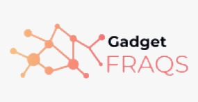

# Gadget Fraqs

##Tech Stack
- React: Component-based web application
    - React Router: To manage multiple pages/routes of the application
- Redux: For managing global state in store
    - Redux Devtools extension: To inspect all Redux-related things
    - Redux Logger: To log our actions in the console
    - Redux Thunk: For asynchronous operations in reducer
- Emotion: To style the components flexibly
- Axios: To fetch data to/from the backend
- JWT Decoder: To decode JWT that is saved in the browserStorage

## Create

-   Design using Figma
-   Fontend built with React and Redux
-   Backend built Node, Express, Sequelize (MySQL) and JWT Auth

## Link

-   Organization:
    -   https://github.com/final-project-igneel
-   Repositories:
    -   https://github.com/final-project-igneel/react-frontend
    -   https://github.com/final-project-igneel/api-backend

## Features

-   Responsive UI
-   Database migration and data seeding
-   User authentication using JSON Web Tokens
-   Can login via Facebook and Google

## Design

Figma: https://www.figma.com/file/xHh7L9OdeJcizlk6J6x1GE/FINAL-PROJECT?node-id=0%3A1

## License

-   MIT License
